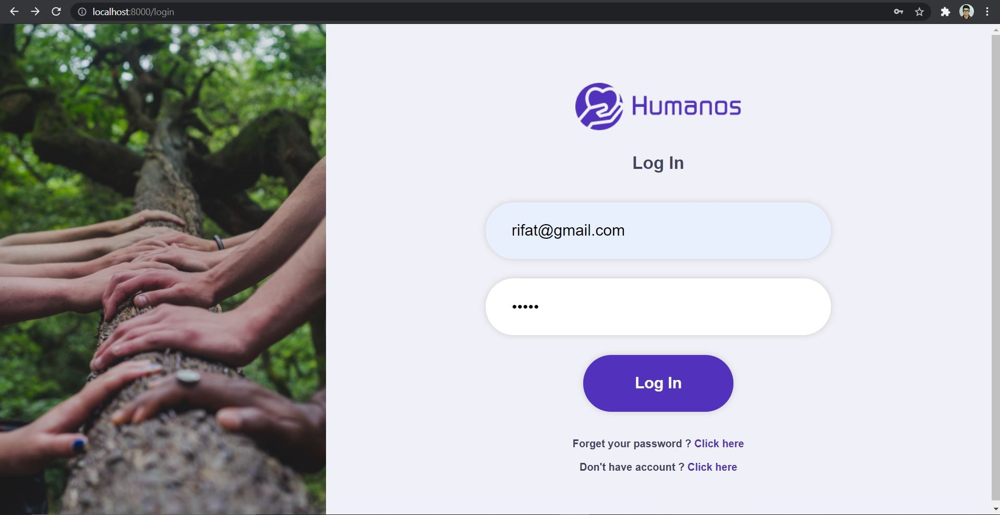
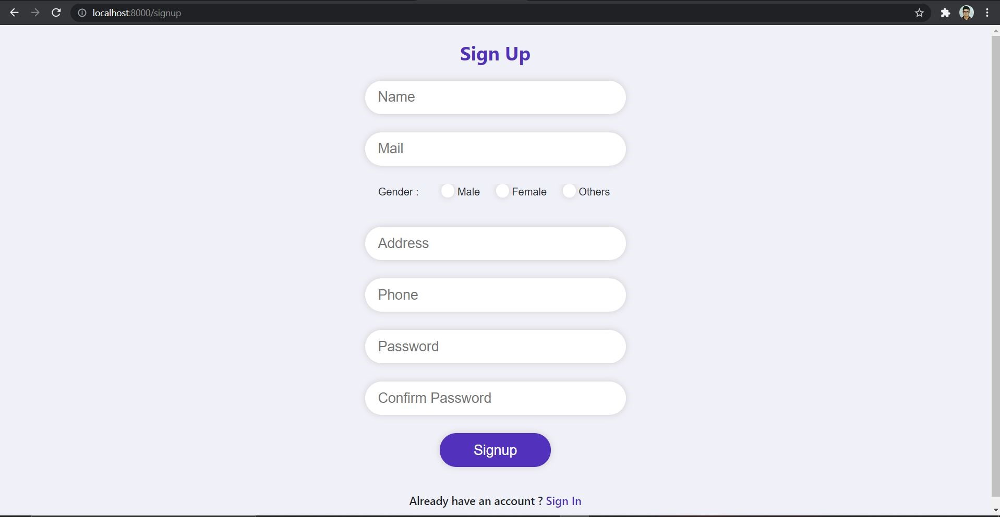
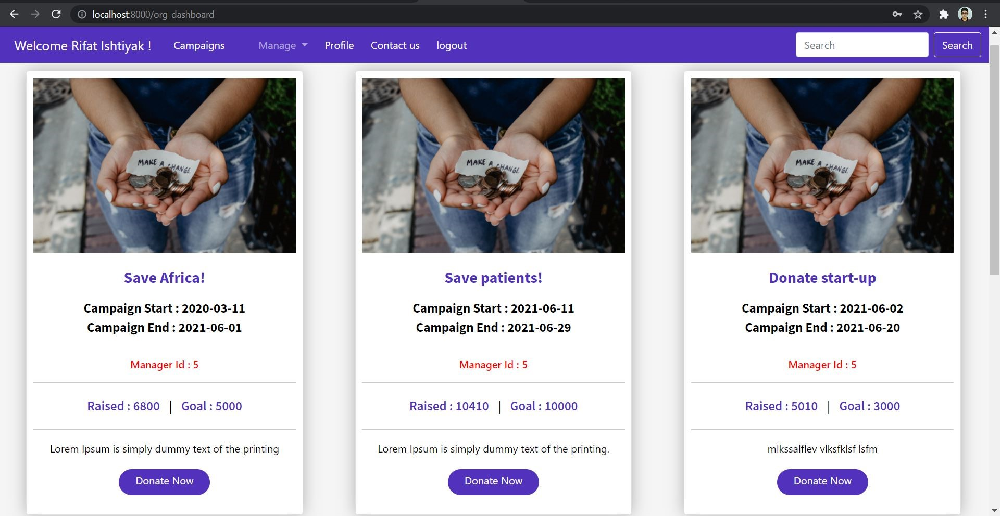
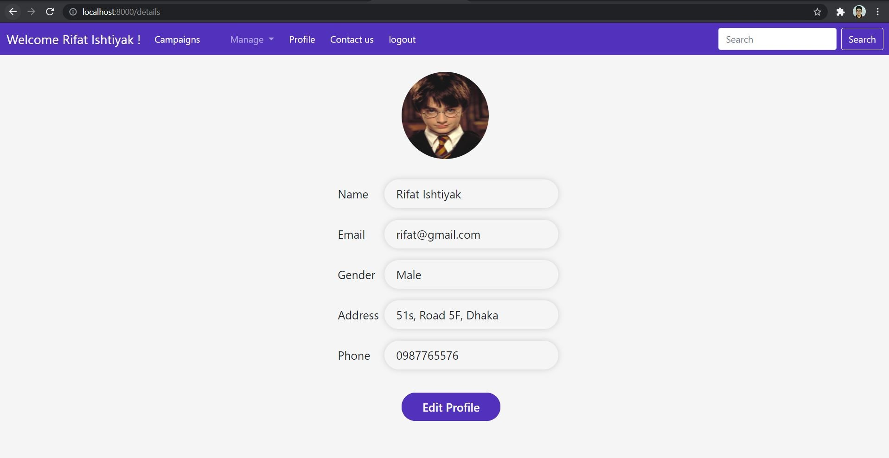
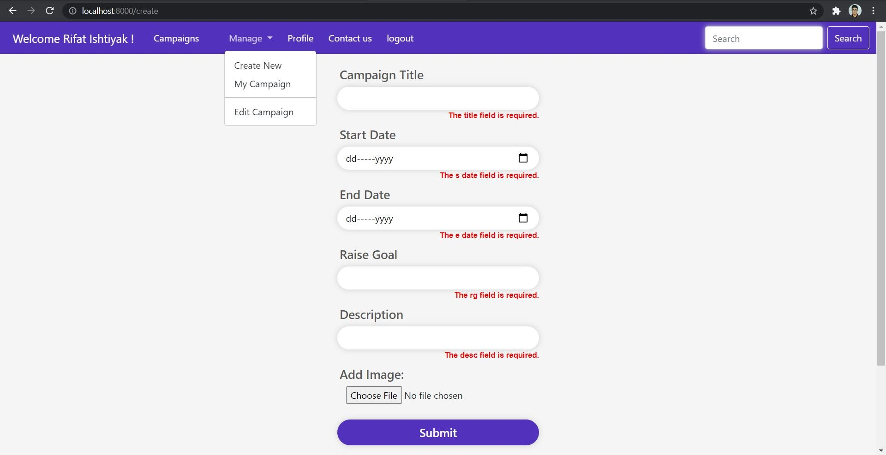
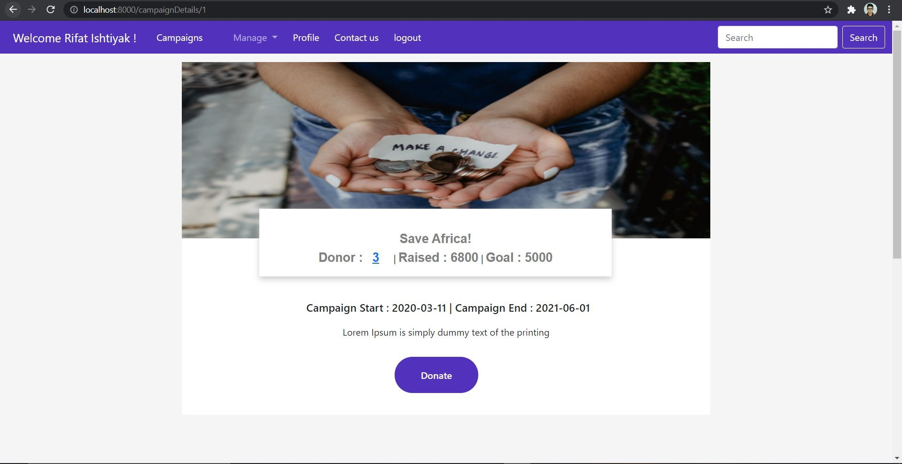
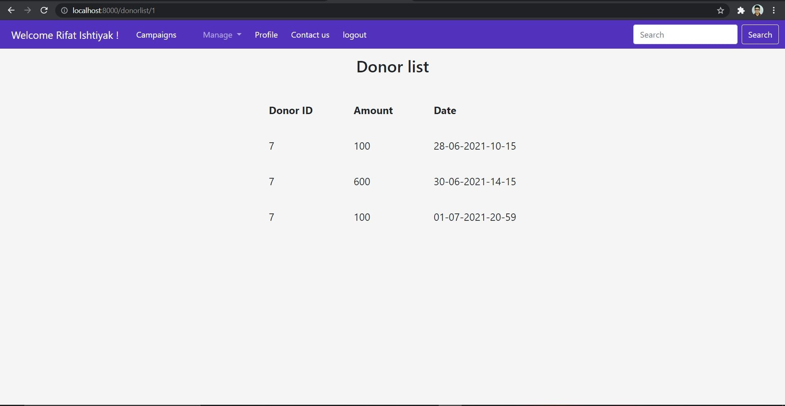
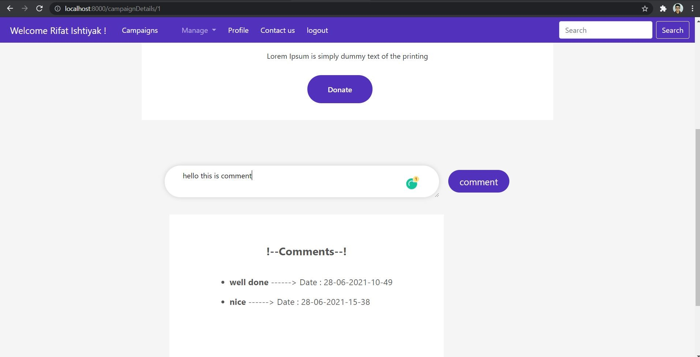

Fundraising for charity is a crowdfunding system based on the donor & recipient of the collected fund, who received funds for his/her/their charity etc. Basically, this project idea or goals Fundraising for charity is social communication with trusted payment service platform to Unprivileged/Startup/Charity organization. Fundraising for charity aims to create an easy, faster, and trusted crowdfunding system between the donor and the recipient.

The organizer will organize the event of donation, Admin will approve the event and handle the events and Manager will handle every event and the donor will donate.

Types of User :  Admin, Manager, Organizer, Donor.

❇️ In this Project My task was to develop the organizer role and I did my best to implement all the features.

📂 For full details and requirements Plz click here 👉 <a href="./file/Midterm_Project_Proposal (module).docx">Project Proposal File</a>

💡 Contributed repository ➡️ <a href="https://github.com/TajbiurShahriorRimon/MidLaravelPoject">github.com/midLaravelProject</a>

📷 Some screenshots of the project is given below :  

    
    
    
    
    
    
    
    

